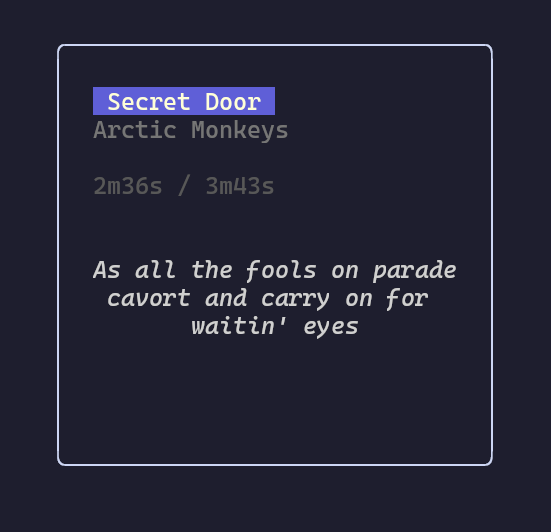

# podden



A minimal **TUI MP3 player** written in Go with [Bubble Tea](https://github.com/charmbracelet/bubbletea) and [beep](https://github.com/gopxl/beep).  

Inspired by the **iPod Classic (5th Gen)**.

## ✨ Features

- **Songs view:** Browse and play songs from your music folder.  
- **Albums view:** Browse albums.  
- **Artists view:** Browse artists.  
- **Playing view:** Show currently playing song details.
- **Playback Controls:** Pause, next, previous, fast forward, rewind.  
- **Lyrics:** Synchronized song lyrics.
- **Configuration:** Customize podden to look how you want it to.

## 📦 Installation

Make sure you have [Go](https://go.dev/dl/) installed (version 1.21+ recommended).  
Then run:

```sh
go install github.com/leanghok120/podden@latest
```

## 🚀 Usage

After installing, simply run:

```sh
podden
```

If you want to use your own music driectory:

```sh
podden -m path
```

### Notes

- Podden is still in very early stages.
- By default, it looks for music in the ~/Music directory. (Use -m to change to your own music directory)
- Plays only `.mp3`, `.flac`, `.m4a` files.

## 🗒️ Todos

- [x] play songs with beep
- [x] pause, next, prev songs
- [x] play the next song after finished
- [x] add albums page
- [x] add artists page
- [x] show elapsed time / total time
- [x] add lyrics 
- [x] fast forward/rewind songs
- [x] allow user to choose their own music folder
- [x] add config
- [x] add a help menu
- [ ] highlight lyrics
- [x] system notifications
- [ ] volume control
- [ ] add cover image

## 🤝 Contributing

Contributions are welcome as long as **they align with what the project's needs**!
If you’d like to help improve podden, you can:

1. Fork the repository
2. Commit your changes
3. Open a Pull Request

## 🙏 Acknowledgements

- [Charmbracelet](https://github.com/charmbracelet) for the TUI libraries
- [gopxl](https://github.com/gopxl/beep) for the beep audio library
- [0xAX](https://github.com/0xAX/notificator) for the desktop library
- [lrclib](https://lrclib.net) for the synchronized lyrics
- The iPod Classic (5th Gen) — for inspiring the look & feel
